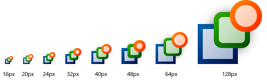

# Icon Development

Dieses Projekt enthält Python-Skripte, mit denen aus einer SVG-Datei Icon-Dateien
für verschiedene Auflösungen und Farbvarianten erzeugt werden können.
Die SVG-Datei muss mit Inkscape vorbereitet werden.

Weitere Informationen über die Verwendung des Skripts
unter <https://honest-devhead.com/posts/icons-1>
und <https://honest-devhead.com/posts/icons-2>.

## License

Copyright by Tobias Kiertscher <dev@mastersign.de>.  
Diese Projekt ist unter der MIT-Lizenz veröffentlicht.
